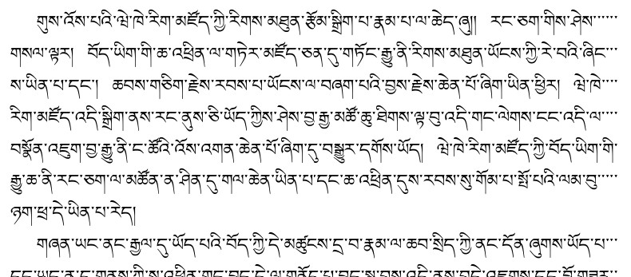

# What's new in babel 3.81

*Draft.*

## Tibetan line breaking and justification (`luatex`)

**Preliminary and tentative**

This feature currently requires loading the language explicitly with
`\babelprovide`, as well as activating it with the macro
`\EnableTibetanHJ` in the preamble. Don’t use it for production.

The rules currently applied are the following (liable to change):

* Spaces are set to 1 em plus .1 em (but see below).
* Line breaking is allowed at spaces, except if between two shads.
* Line breaking is allowed after a tsek, except if followed by a shad.
  (This rule must be fine tuned.)
* Justification is done with filling tseks.

There are no rules for *rin chen spungs shad* yet. It’s worth noting the
number of trailing tseks can be dramatically reduced with
`microtype`, but this isn’t necessarily the desired behavior.

Here is a sample document (text picked randomly from the Wikipedia)
with a Windows font:
```tex
\documentclass[twocolumn]{article}

\usepackage{babel}
\babelprovide[import, main, justification=unhyphenated]{tibetan}
\babelfont{rm}{Microsoft Himalaya}

\EnableTibetanHJ

\begin{document}

གུས་འོས་པའི་ཝེ་ཁེ་རིག་མཛོད་ཀྱི་རིགས་མཐུན་རྩོམ་སྒྲིག་པ་རྣམ་པ་ལ་ཆེད་ཞུ།།
རང་ཅག་གིས་ཤེས་གསལ་ལྟར།
བོད་ཡིག་གི་ཆ་འཕྲིན་ལ་གཏེར་མཛོད་ཅན་དུ་གཏོང་རྒྱུ་ནི་རིགས་མཐུན་ཡོངས་ཀྱི་རེ་བའི་ཞིང་ས་ཡིན་པ་དང་།
ཆབས་གཅིག་རྗེས་རབས་པ་ཡོངས་ལ་བཞག་པའི་བྱས་རྗེས་ཆེན་པོ་ཞིག་ཡིན་ཕྱིར།
ཝེ་ཁེ་རིག་མཛོད་འདི་སྒྲིག་ནས་རང་ནུས་ཅི་ཡོད་ཀྱིས་ཤེས་བྱ་རྒྱ་མཚོ་ཆུ་ཐིགས་ལྟ་བུ་འདི་གང་ལེགས་ངང་འདི་ལ་བསྣོན་འཇུག་བྱ་རྒྱུ་ནི་ང་ཚོའི་འོས་འགན་ཆེན་པོ་ཞིག་དུ་བསྒྱུར་དགོས་ཡོད།
ཝེ་ཁེ་རིག་མཛོད་ཀྱི་བོད་ཡིག་གི་རྒྱུ་ཆ་ནི་རང་ཅག་ལ་མཚོན་ན་ཤིན་དུ་གལ་ཆེན་ཡིན་པ་དང་ཆ་འཕྲིན་དུས་རབས་སུ་གོམ་པ་སྤོ་པའི་ལམ་བུ་ཉག་ཕྲ་དེ་ཡིན་པ་རེད།

གཞན་ཡང་ནང་རྒྱལ་དུ་ཡོད་པའི་བོད་ཀྱི་དེ་མཚུངས་དྲ་བ་རྣམ་ལ་ཆབ་སྲིད་ཀྱི་ནང་དོན་ཞུགས་ཡོད་པ་དང་ཡང་ན་དྲ་གནས་ཀྱི་ས་འཕྲིན་གང་བྱུང་དེ་ལ་གནོད་པ་བྱུང་སླ་བས་འདི་ནས་བདེ་འཇགས་དང་བློ་གཟུར་བོར་གནས་པའི་རིག་གནས་ཤེས་བྱ་སོགས་སྤེལ་པར་མཐུན་རྐྱེན་ལེགས་པོ་མཁྱོངས་ཡོད།
དེ་བས་མཐུན་རྐྱེན་བཟང་པོ་འདི་ཉིད་མཁོ་དང་བསྟུན་ནས་དམ་འཛིན་བྱ་རྒྱུར་ཀུན་ལ་འོས་འགན་ཡོད་པ་རེད།
ང་ཚོ་ནས་བཟུང་སྟེ་འགོ་བརྩམས་ནས་རིགས་མཐུན་གང་མང་འདིའི་ཕྱོགས་ལ་ཁ་སྣོན་རྒྱག་པའི་ལས་སུ་ཞུགས་པའི་རེ་སྐུལ་དང་བཅས།།
ནམ་ཡིན་ཡང་རང་གིས་རིག་གནས་འདི་ཉིད་མ་ཉམས་གོང་སྤེལ་དུ་གཏོང་རྒྱུ་དང་ཆ་འཕྲིན་དུས་རབས་འདི་ལ་བེད་དང་ལྡན་པའི་དོན་གཉེར་རྒྱུའི་འདུན་པ་དང་བཅས།
རིགས་མཐུན་ཡོངས་ལ་བཀྲ་ཤིས་བདེ་ལེགས་ཞུ།
ཞེས་བོད་ཀྱི་ཆ་འཕྲིན་ལག་རྩལ་པ་བསོད་ནམས་གངས་རྒྱན་ནས།

\end{document}
```


The algorithm devised fot the Tibetan justification is based on that
for Arabic (remember the latter is useable in many cases but not
complete). Please, feel free to contribute, because any help will be
most welcome.

To ease testings, there is an optional argument to `\EnableTibetanHJ` so
that `\EnableTibetanHJ[.7 .05 0.01]` sets the space to .7 em plus .05 em
minus 0.01 em.

## Locales

* More updates to the CLDR 41: Burmese, Dutch, Kwasio, Malay, Marathi,
  Mazanderani, Nepali, Norwegian, Norwegian Nynorsk.
  
## `fontspec` warning

After some attempts to deal with the `fontspec` warnings about
inexistent languages and scripts, now they are concealed when fonts are
defined with `\babelfont` (but not otherwise). In most cases they are
useless and even misleading, because many fonts don’t set the
language system, many people know nothing about this OpenType feature,
and some even think those warnings refer to the availability of the
language in `babel`.
