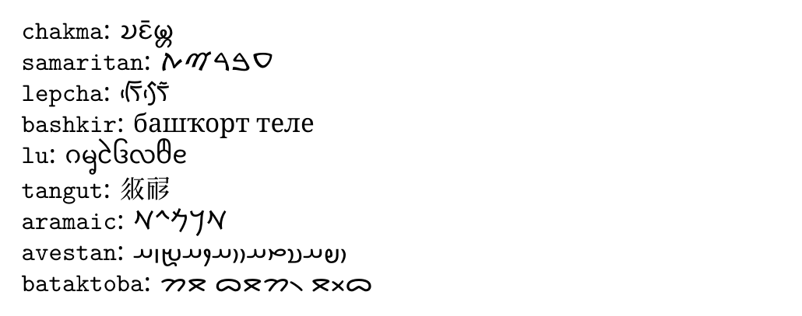

# What's new in babel 3.99

2023-12-10

## Fix

Spurious space in some cases because of a missing %, a bug introduced
in 3.98.

## New locales

There are two new locales: `chakma` and `lowgerman`.

In addition, the following bare minimum locales have been added:

* `aramaic`
* `avestan`
* `aymara`
* `bashkir`
* `bataktoba`
* `bavarian`
* `classicalmandaic`
* `ingush`
* `komi`
* `lepcha`
* `limbu`
* `lineara`
* `lu`
* `makasar`
* `samaritan`
* `sinteromani`
* `tainua`
* `tangut`
* `waray`

Most scripts in the Unicode basic plane are now covered with, at
least, a minimal locale.

Here is a sample, with `lualatex` and the Noto family:

```tex
\documentclass{article}

\usepackage[bidi=basic]{babel}

\usepackage{fontspec}
\defaultfontfeatures{Renderer=Harfbuzz}
\babelfont{rm}{NotoSerif-Regular.otf}
\babelfont[chakma]{rm}{NotoSansChakma-Regular.otf}
\babelfont[samaritan]{rm}{NotoSansSamaritan-Regular.otf}
\babelfont[lepcha]{rm}{NotoSansLepcha-Regular.otf}
\babelfont[lu]{rm}{NotoSansNewTaiLue-Regular.otf}
\babelfont[tangut]{rm}{NotoSerifTangut-Regular.otf}
\babelfont[aramaic]{rm}{NotoSansImperialAramaic-Regular.otf}
\babelfont[avestan]{rm}{NotoSansAvestan-Regular.otf}
\babelfont[bataktoba]{rm}{NotoSansBatak-Regular.otf}

\newcommand{\showname}[1]{%
  \par\texttt{#1}:
  \foreignlanguage{#1}{%
    \getlocaleproperty\result{#1}{identification/name.local}%
    \result}}

\begin{document}

\showname{chakma}
\showname{samaritan}
\showname{lepcha}
\showname{bashkir}
\showname{lu}
\showname{tangut}
\showname{aramaic}
\showname{avestan}
\showname{bataktoba}

\end{document}
```

